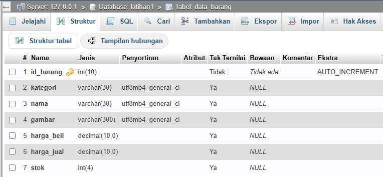
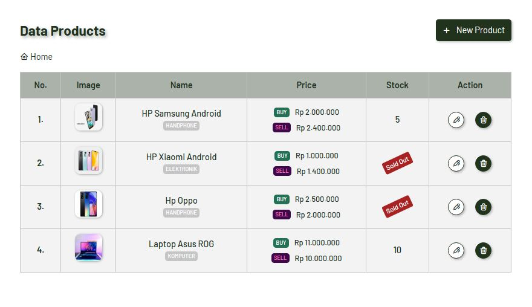
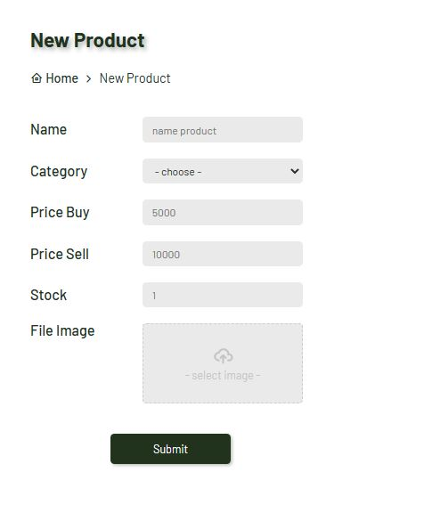

# PROJECT PRAKTIKUM 3 (PHP dan Database MySQL)

**_Nama: Muhammad Akbar_** <br/>
**_Nim : 312110483_** <br/>
**_Kelas : TI.21.A3_** <br/>

<br/><br/>

## **Database**

### _Output_ :


### _Code_ :
```sql
CREATE DATABASE latihan1;

CREATE TABLE data_barang (
    id_barang int(10) auto_increment Primary Key,
    kategori varchar(30),
    nama varchar(30),
    gambar varchar(100),
    harga_beli decimal(10,0),
    harga_jual decimal(10,0),
    stok int(4)
);
```

### _Info_ :
- membuat database dengan nama `latihan1`
- membuat tabel dengan nama `data_barang`
- selain bisa menggunakan perintah `sql` juga bisa langsung import dari file `assets/sql/latihan1.sql`


<br/><br/>

## **Connection to Database**

### _Code_ :
```php
$host = "localhost";
$user = "root";
$pass = "";
$db = "latihan1";

$conn = mysqli_connect($host, $user, $pass, $db);

if (!$conn) {
  die("Gagal terkoneksi dengan database : " . mysqli_connect_error());
}

```

### _Info_ :
- pengkondisian `!$conn` adalah jika gagal dalam mengkoneksikan maka akan menampilkan pesan error tersebut


<br/><br/>

## **Home**

### _Output_ :


### _Code_ :
```php
$sql = 'SELECT * FROM data_barang';
$result = mysqli_query($conn, $sql);
```

### _Info_ :
- Pada homepage menampilkan semua `record` pada table `data_barang`
- memvalidasi jika `stock < 0` maka akan di tampilkan label `Sold Out`

<br/><br/>

## **Create**

### _Output_ :


### _Code_ :
```php
if (isset($_POST['create'])) {
	$nama = $_POST['nama'];
	$kategori = $_POST['kategori'];
	$harga_jual = $_POST['harga_jual'];
	$harga_beli = $_POST['harga_beli'];
	$stok = $_POST['stok'];
	$file_gambar = $_FILES['image'];
	$gambar = null;
	if ($file_gambar['error'] == 0) {
		$filename = str_replace(' ', '_', $file_gambar['name']);
		$destination = 'assets/images/' . $filename;
		if (move_uploaded_file($file_gambar['tmp_name'], $destination)) {
			$gambar = $filename;
		}
	}
	$sql = "INSERT INTO data_barang (nama, kategori, harga_jual, harga_beli, stok, gambar) VALUES ('{$nama}', '{$kategori}', '{$harga_jual}', '{$harga_beli}', '{$stok}', '{$gambar}')";
	$result = mysqli_query($conn, $sql);
	header('Location: ' . $path);
}
```

### _Info_ :
- pada saat mengupload `file_gambar` akan mengambil nama file dan mereplace setiap karakter `spasi` menjadi `_`
- `move_upload_file()` adalah fungsi PHP yang digunakan untuk memindahkan file yang diunggah ke locasi baru
- pada kasus ini file akan pindahkan atau di copy ke dalam path `assets/images/`
- kekurangan form ini adalah belum ada validasi untuk setiap inputannya dan belum ada validasi untuk file yang di upload sehingga dapat mudah dimanipulasi inputannya oleh user


<br/><br/>

## **Update**

### _Output_ :


### _Code_ :
```php
$id = $_GET['id'];
$sql = "SELECT * FROM data_barang WHERE id_barang = '{$id}'";
$result = mysqli_query($conn, $sql);
if (!$result) die('Error: Data tidak tersedia');
$data = mysqli_fetch_array($result);

if (isset($_POST['update'])) {
	$id = $_POST['id'];
	$nama = $_POST['nama'];
	$kategori = $_POST['kategori'];
	$harga_jual = $_POST['harga_jual'];
	$harga_beli = $_POST['harga_beli'];
	$stok = $_POST['stok'];
	$file_gambar = $_FILES['image'];
	$gambar = null;
	if ($file_gambar['error'] == 0) {
		$filename = str_replace(' ', '_', $file_gambar['name']);
		$destination = 'assets/images/' . $filename;
		if (move_uploaded_file($file_gambar['tmp_name'], $destination)) {
			$gambar = $filename;
		}
	}
	$sql = "UPDATE data_barang SET 
            nama = '{$nama}', 
            kategori = '{$kategori}', 
            harga_jual = '{$harga_jual}', 
            harga_beli = '{$harga_beli}',
            stok = '{$stok}'";
	if (!empty($gambar)) {
		$sql .= ", gambar = '{$gambar}'";
	}
	$sql .= " WHERE id_barang = '{$id}'";
	$result = mysqli_query($conn, $sql);
	header('Location: ' . $path);
}
```

### _Info_ :
- `$_GET['id'];` mengambil value dari parameter `id` pada method `GET`
- mengambil data dari database dan menampilkannya pada value input form
- sama seperti form `create` dalam mengolah datanya namun pada saat memindahkan file image akan di validasi apakah nama file tersebut sudah ada pada path `assets/images/` jika sudah ada maka file image tidak akan ditambahkan lagi
- kekurangannya pada validasi ini adalah jika user memiliki image dengan nama yang sama namun berbeda secara visual maka file akan konflik dan akan menampilkan gambar yang tidak sesuai, sebaiknya nama file di `hash` misal dengan `md5` agar file menjadi unik


<br/><br/>

## **Delete**

### _Code_ :
```php
$id = $_GET['id'];
$sql = "DELETE FROM data_barang WHERE id_barang = '{$id}'";
$result = mysqli_query($conn, $sql);
header('Location: ' . $path);
```

### _Info_ :
- `$_GET['id'];` mengambil value dari parameter `id` pada method `GET`
- melakukan perintah `SQL` yaitu menghapus product dengan parameter `id_barang`

<br/>

## **Directory Tree**
```bash
Lab3Web
│ 
├──.htaccess
├──index.php
├──README.md
│
├──assets
│   ├──css
│   │   ├──normalize.css
│   │   └──style.css
│   │
│   ├──images
│   │   ├──laptop.jpg
│   │   ├──oppo.jpg
│   │   ├──samsung.jpg
│   │   └──xiaomi.jpg
│   │
│   ├──js
│   │   └──script.js
│   │
│   └──sql
│       └──latihan1.sql
│
├──includes
│   ├──footer.php
│   └──header.php
│
├──requires
│   ├──connection.php
│   └──function.php
│
├──screenshot
│   ├──Create.JPG
│   ├──Database.JPG
│   ├──Home.JPG
│   └──Update.JPG
│
└──views
    ├──404.php
    ├──create.php
    ├──delete.php
    ├──home.php
    └──update.php
```
